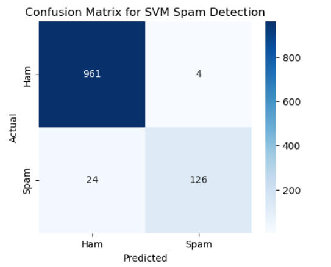

# Implementation-of-SVM-For-Spam-Mail-Detection

## AIM:
To write a program to implement the SVM For Spam Mail Detection.

## Equipments Required:
1. Hardware – PCs
2. Anaconda – Python 3.7 Installation / Jupyter notebook

## Algorithm
1. Import the necessary python packages using import statements.
2. Read the given csv file using read_csv() method and print the number of contents to be displayed using df.head().

3. Split the dataset using train_test_split.

4. Calculate Y_Pred and accuracy.

5. Print all the outputs. 6.End the Program.

## Program:

## Developed by: HEMALISHA T
## RegisterNumber:  212225040123

```

import pandas as pd
from sklearn.model_selection import train_test_split
from sklearn.feature_extraction.text import TfidfVectorizer

from sklearn.svm import SVC
from sklearn.metrics import confusion_matrix

import matplotlib.pyplot as plt
import seaborn as sns

data = pd.read_csv("spam.csv", encoding='latin-1')

data = data[['v1', 'v2']]
data.columns = ['label', 'message']

data['label'] = data['label'].map({'ham':0, 'spam':1})

X = data['message']
y = data['label']

vectorizer = TfidfVectorizer(stop_words='english')
X_vectorized = vectorizer.fit_transform(X)

X_train, X_test, y_train, y_test = train_test_split(
    X_vectorized, y, test_size=0.2, random_state=42
)

model = SVC(kernel='linear')

model.fit(X_train, y_train)

y_pred = model.predict(X_test)

cm = confusion_matrix(y_test, y_pred)

plt.figure(figsize=(5,4))

sns.heatmap(
    cm,
    annot=True,
    fmt='d',
    cmap='Blues',
    xticklabels=['Ham', 'Spam'],
    yticklabels=['Ham', 'Spam']
)

plt.xlabel("Predicted")
plt.ylabel("Actual")

plt.title("Confusion Matrix for SVM Spam Detection")

plt.show()
```

## Output:



## Result:
Thus the program to implement the SVM For Spam Mail Detection is written and verified using python programming.
